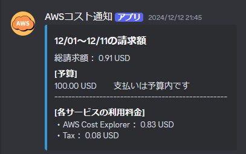
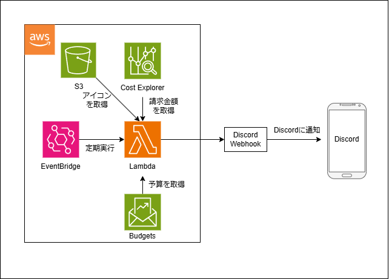

# Discordに定期的にAWSのコスト通知を行う
実際の動作した場合

# アーキ図

# 参考

- AWSでやらかしたので料金をWebhook(Discord)に通知できるようにした振り返り 
https://zenn.dev/satory074/articles/satory074_2021091401

- AWSサービス毎の請求額を毎日Slackに通知してみた 
https://dev.classmethod.jp/articles/notify-slack-aws-billing/

- 【Python3】コマンドラインから簡単にAWS lambdaに関数をアップロード出来ちゃう「lambda-uploader」のインストール方法と使い方【手順まとめ】 
https://blogenist.jp/2019/01/16/7479/#lambda-uploader

- AWS 初めてのLambda（本当の初心者向け２） 
https://www.guri2o1667.work/entry/2020/07/03/AWS_%E5%88%9D%E3%82%81%E3%81%A6%E3%81%AELambda%EF%BC%88%E6%9C%AC%E5%BD%93%E3%81%AE%E5%88%9D%E5%BF%83%E8%80%85%E5%90%91%E3%81%91%EF%BC%92%EF%BC%89
